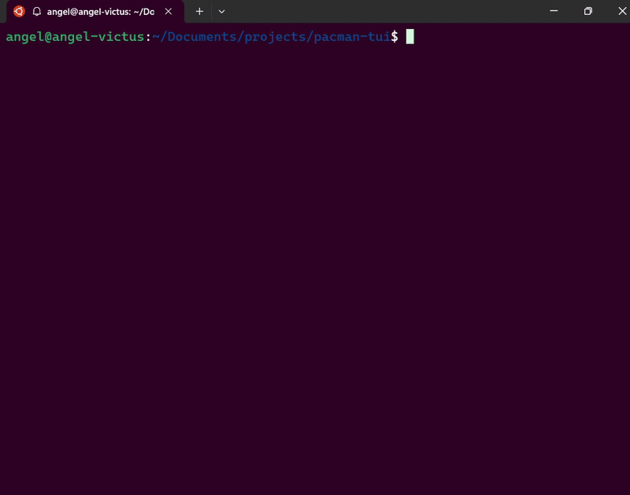

# Pacman TUI
A Pacman clone written in ncurses with C

## Demo


## Installation
1. Clone the repository and change the current directory to it.
```sh
git clone https://github.com/AngelAlvCam/pacman-tui.git
cd pacman-tui
```

2. Compile.
```sh
gcc pacman.c -o pacman -lncurses
```

## Usage
### Run the game
```sh
./pacman
```

## Controls
- `Arrow keys` to move Pacman across the board.